<div align="center">

# DevPulse

### Incident and service management for engineering teams

Monitoring tools push alerts in. A background worker turns serious ones into incidents automatically.
Engineers work each incident through an enforced lifecycle, and everything updates live in the browser.

[](https://github.com/anishvs14/devpulse/actions/workflows/ci.yml)


<br>

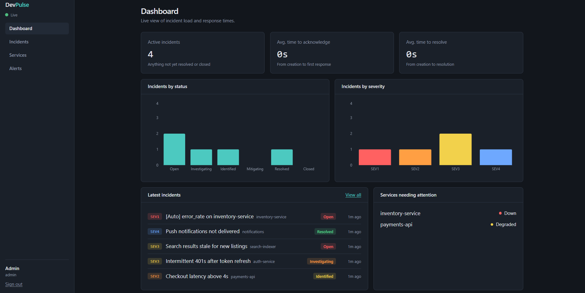

</div>

---

## Why this project exists

When something breaks in production, three things matter: **how fast you find out, how clearly the team can coordinate, and what you learn afterwards.** DevPulse is a small PagerDuty / Opsgenie-style platform that covers all three:

1. **Detect.** Monitors send alerts to an API key-protected endpoint that acknowledges instantly and never blocks.
2. **Respond.** A worker process triages each alert, marks the service `DOWN` or `DEGRADED`, and opens an incident (or groups the alert onto one that is already open, so a burst of 50 alerts is one incident, not 50).
3. **Learn.** Every change is written to an audit trail, and resolved incidents get a structured postmortem.

It is built the way a real service would be: separate API and worker processes, a message queue, an enforced state machine, role- and ownership-based authorization, integration tests against real databases, and a CI pipeline.

## Screenshots

<table>
  <tr>
    <td width="50%">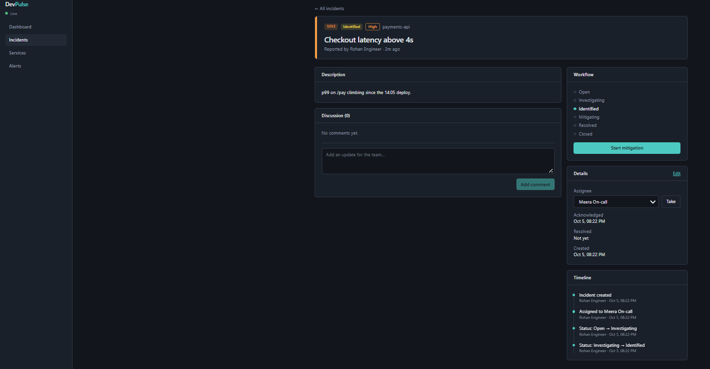<br><sub><b>Incident detail:</b> server-enforced workflow, assignment, discussion and a full audit timeline.</sub></td>
    <td width="50%">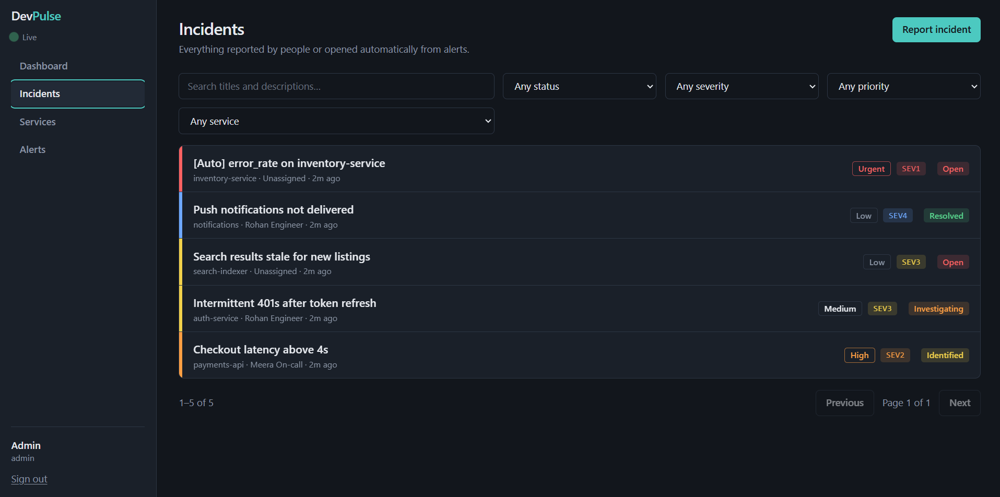<br><sub><b>Incident list:</b> search, filters and pagination, all kept in the URL so views are shareable.</sub></td>
  </tr>
  <tr>
    <td width="50%">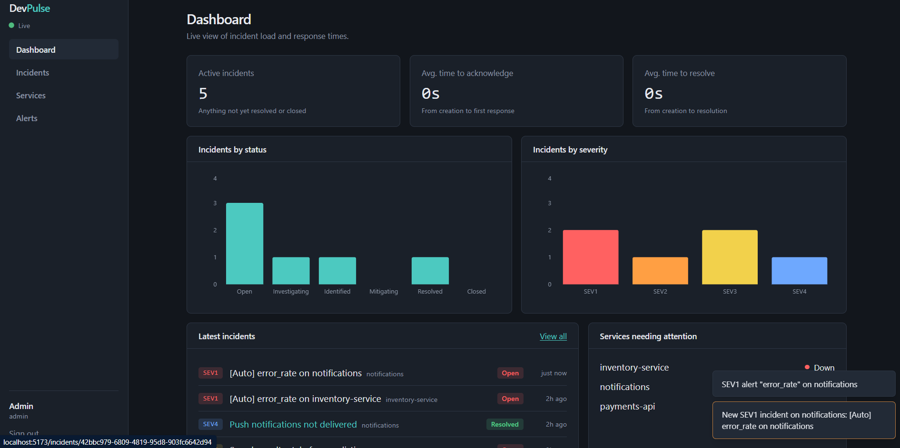<br><sub><b>Live updates:</b> a SEV1 alert arrives, an incident opens and every open browser is notified.</sub></td>
    <td width="50%">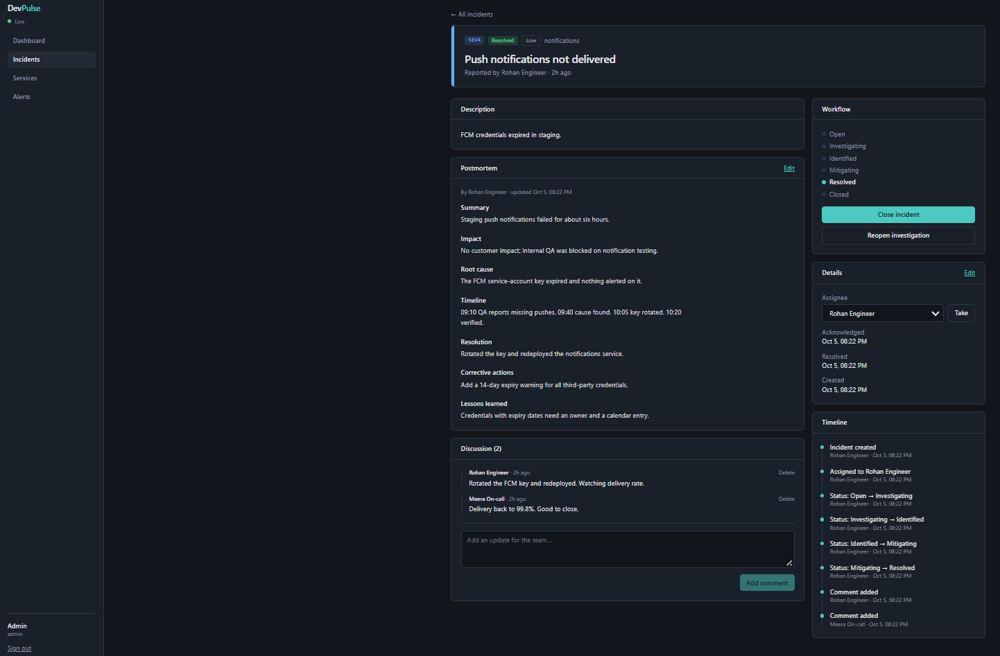<br><sub><b>Postmortems:</b> root cause, timeline and corrective actions, available once an incident is resolved.</sub></td>
  </tr>
  <tr>
    <td width="50%">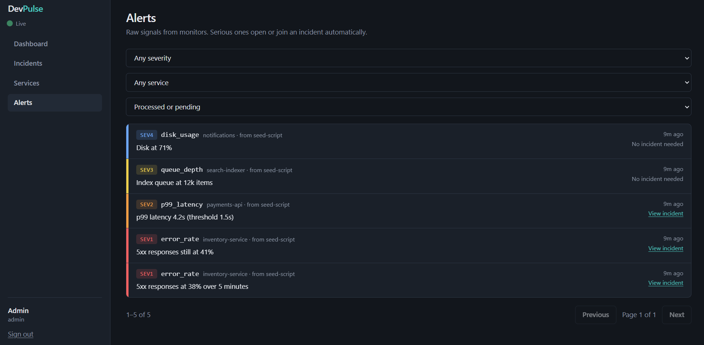<br><sub><b>Alerts:</b> every alert traced to the incident it created or joined.</sub></td>
    <td width="50%">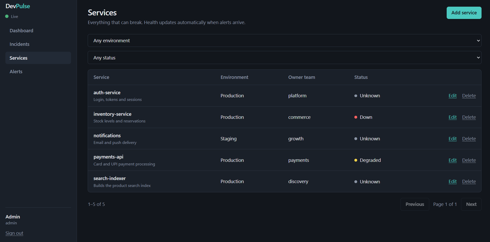<br><sub><b>Services:</b> health updates automatically as alerts arrive.</sub></td>
  </tr>
</table>

<details>
<summary><b>More: API docs and quality gates</b></summary>
<br>

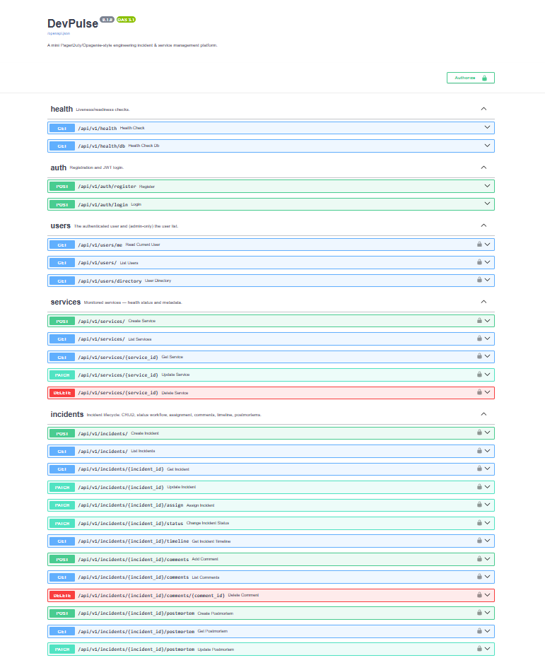

<sub>Interactive API documentation at <code>/docs</code>, generated from the typed request and response models.</sub>

<br><br>

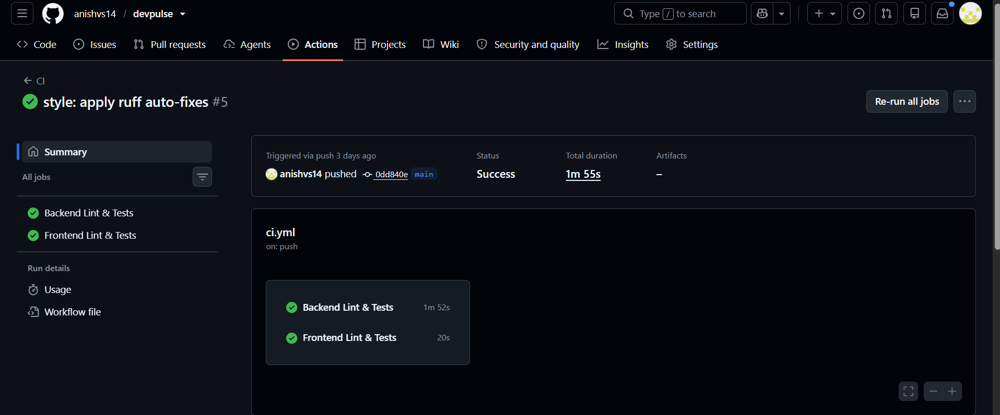

<sub>Every push runs lint, a migration-drift check, the test suites and the production image builds.</sub>

<br><br>

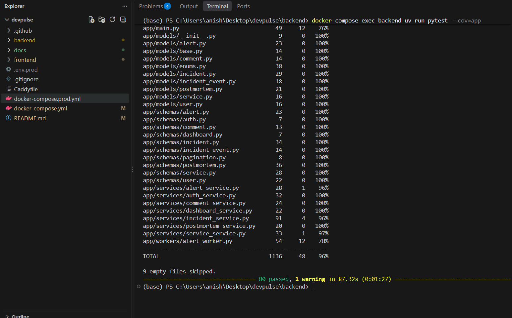

<sub>80 backend integration tests against real PostgreSQL and Redis.</sub>

</details>

## Features

**Alerting**
- Ingestion endpoint protected by an API key; returns `202` immediately and queues the work
- Automatic service health: `SEV1` marks a service `DOWN`, `SEV2` marks it `DEGRADED`
- Auto-created incidents, with **alert-storm grouping** so repeated alerts attach to the open incident instead of creating duplicates

**Incident management**
- Six-state lifecycle (`OPEN → INVESTIGATING → IDENTIFIED → MITIGATING → RESOLVED → CLOSED`) enforced by the server; skipping a step is rejected with `400`, and a resolved incident can be reopened
- Immutable **audit trail**: every status, severity, priority and assignee change records who did it and when
- Assignment, comments, search, filters and pagination
- **Postmortems** (summary, impact, root cause, timeline, resolution, corrective actions, lessons), only for resolved or closed incidents

**Visibility**
- Dashboard with active incidents, status and severity breakdowns, and **mean time to acknowledge / resolve** computed from real timestamps
- Real-time updates over a single WebSocket: toasts, live dashboard refresh, live service health

**Security**
- JWT authentication with bcrypt password hashing
- Role-based access (`ADMIN`, `ENGINEER`, `VIEWER`) **plus** ownership rules: only the reporter, assignee or an admin can edit an incident or write its postmortem
- Login errors that don't reveal whether an email exists; auth tokens redacted from server logs

## Architecture

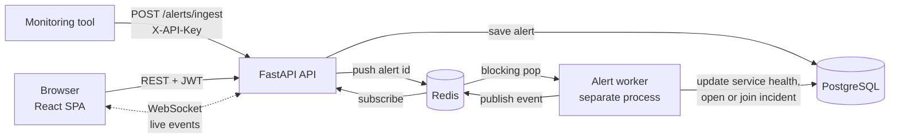

The API and the worker are **separate processes that share no memory**. Redis connects them in both directions: a *list* carries work to the worker, and *pub/sub* carries results back so the API can fan them out to every connected browser.

### What happens when an alert arrives

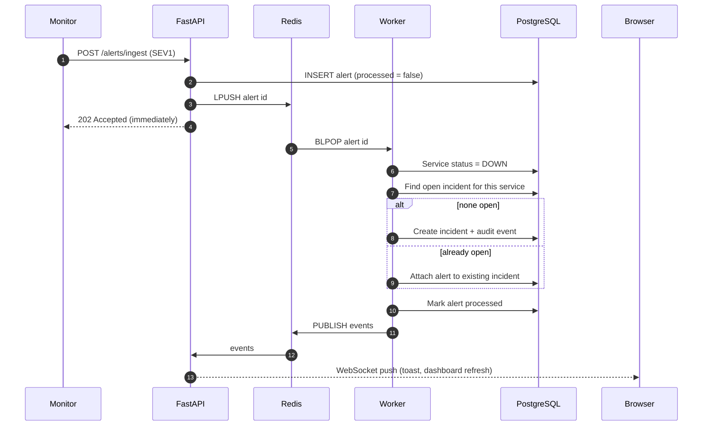

## Data model

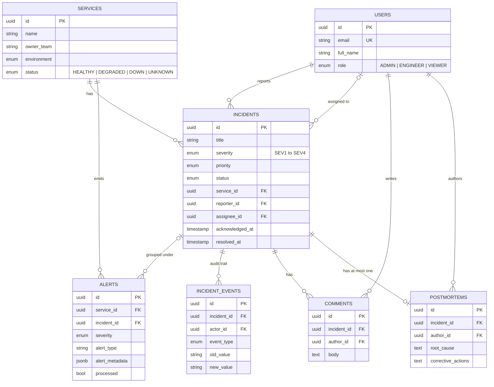

Deleting a service that still has incidents is refused with `409` (`ON DELETE RESTRICT`), so incident history is never silently destroyed.

## Tech stack

| Layer | Technology |
|---|---|
| **API** | Python 3.12, FastAPI, Pydantic v2, async SQLAlchemy 2.0 (asyncpg) |
| **Database** | PostgreSQL 16 (native enums, JSONB), Alembic migrations |
| **Queue and realtime** | Redis 7: list as a work queue, pub/sub for live events; WebSockets |
| **Auth** | JWT (HS256), bcrypt, role- and ownership-based authorization |
| **Frontend** | React, TypeScript, Vite, Tailwind CSS, React Router, Recharts |
| **Testing** | pytest + pytest-asyncio + coverage (backend), Vitest + Testing Library (frontend) |
| **DevOps** | Docker, Docker Compose, GitHub Actions, nginx, Caddy (automatic HTTPS), ruff, uv |

## Engineering highlights

| Problem | How it is solved |
|---|---|
| Monitors must not wait on slow work | Ingestion returns `202` and queues the alert; a separate worker does the processing |
| A burst of alerts shouldn't create a burst of incidents | The worker attaches alerts to the service's open incident; a regression test guards the linking |
| Illegal workflow jumps | A server-side transition table; the UI mirrors it only to choose which buttons to show, and a contract test fails if the two drift |
| Who may change what | Roles gate actions; ownership gates edits; the API enforces both and the tests assert every `403` |
| Tests that mean something | Integration tests run against real PostgreSQL and Redis, because mocks would hide enum, JSONB and SQL-specific bugs. Key behaviours were deliberately broken to confirm the suite fails |
| Schema drift | CI applies every migration to an empty database and runs `alembic check`, failing if a model changed without a migration |
| Credentials in logs | Browsers can't send headers on a WebSocket, so the JWT travels in the URL. A log filter redacts it, and nginx logs paths only; verified with zero tokens found in API, worker or proxy logs |
| Works behind a reverse proxy | The frontend resolves its WebSocket URL against the page origin, so relative API paths work in production |

## Getting started

**Prerequisites:** Docker, Python 3.12 with [uv](https://docs.astral.sh/uv/), Node 22.

```bash
# 1. Start PostgreSQL and Redis
docker compose up -d postgres redis

# 2. Backend (API on :8000, interactive docs at /docs)
cd backend
cp .env.example .env            # set SECRET_KEY and ALERT_INGEST_API_KEY
uv sync
uv run alembic upgrade head
uv run fastapi dev app/main.py

# 3. Alert worker (second terminal, in backend/)
uv run python -m app.workers.alert_worker

# 4. Frontend (third terminal)
cd frontend
npm install
npm run dev                     # http://localhost:5173
```

### Load demo data

With the API and worker running, fill the app with realistic incidents, services and alerts. The script uses the **public API**, so the data goes through the same validation and pipeline as real use:

```bash
cd backend
uv run python scripts/seed.py
```

| Role | Email | Password |
|---|---|---|
| Admin | `admin@example.com` | `demo-password-123` |
| Engineer | `engineer@example.com` | `demo-password-123` |
| Engineer | `oncall@example.com` | `demo-password-123` |
| Viewer | `viewer@example.com` | `demo-password-123` |

> These are demo credentials. Never run the seed script against a real deployment.

### Send your own alert

```bash
curl -X POST http://localhost:8000/api/v1/alerts/ingest \
  -H "X-API-Key: $ALERT_INGEST_API_KEY" \
  -H "Content-Type: application/json" \
  -d '{"service_id":"<service-uuid>","severity":"SEV1","alert_type":"high_cpu","message":"CPU at 98%","source":"curl"}'
```

Watch the service flip to `DOWN`, an incident appear, and the toast fire in the browser.

## Testing and CI

```bash
cd backend  && uv run pytest --cov=app     # 80 tests, ~96% coverage
cd frontend && npm test                    # 40 tests
```

The backend suite covers authentication and token handling, role and ownership rules, the full incident workflow, comments, postmortems, the alert → worker → incident pipeline (including alert-storm grouping and real-time event publishing), dashboard calculations, WebSocket authentication and error handling.

[GitHub Actions](.github/workflows/ci.yml) runs on every push and pull request:

| Job | What it checks |
|---|---|
| **Backend** | `ruff` lint · migrations apply to an empty database · `alembic check` · pytest with a **90% coverage gate** |
| **Frontend** | unit and component tests · TypeScript type-check · production build |
| **Docker** | both production images build |

## Deployment

The production stack is one command: **Caddy** (automatic HTTPS) → **nginx** (serves the React build, proxies the API and WebSocket) → FastAPI, with a one-shot migration job, the worker, PostgreSQL and Redis. Only ports 80 and 443 are exposed; the database and queue are reachable only from other containers.

```bash
cp .env.prod.example .env.prod          # fill in every CHANGE_ME
docker compose --env-file .env.prod -f docker-compose.prod.yml up -d --build
```

Full walkthrough, backups and troubleshooting: [docs/DEPLOYMENT.md](docs/DEPLOYMENT.md).

## API overview

Interactive documentation is served at `/docs`.

| Area | Endpoints |
|---|---|
| **Auth** | `POST /auth/register` · `POST /auth/login` |
| **Users** | `GET /users/me` · `GET /users/` (admin) · `GET /users/directory` |
| **Services** | `GET/POST /services/` · `GET/PATCH/DELETE /services/{id}` (writes are admin-only) |
| **Incidents** | `GET/POST /incidents/` · `GET/PATCH /incidents/{id}` · `PATCH …/assign` · `PATCH …/status` · `GET …/timeline` |
| **Collaboration** | `GET/POST …/comments` · `DELETE …/comments/{id}` · `GET/POST/PATCH …/postmortem` |
| **Alerts** | `POST /alerts/ingest` (API key) · `GET /alerts/` · `GET /alerts/{id}` |
| **Dashboard** | `GET /dashboard/summary` |
| **Realtime** | `WS /ws/updates?token=<jwt>` |

## Project structure

```
devpulse/
├── backend/
│   ├── app/
│   │   ├── api/v1/        route handlers: thin, validation and permissions only
│   │   ├── services/      business logic: workflow rules, grouping, metrics
│   │   ├── models/        SQLAlchemy models        schemas/  Pydantic models
│   │   ├── workers/       alert worker (separate process)
│   │   └── core/          config, security, Redis, logging
│   ├── alembic/           database migrations
│   ├── tests/             integration tests (real PostgreSQL + Redis)
│   └── scripts/seed.py    demo data through the public API
├── frontend/
│   └── src/               pages · components · contexts · typed API client · tests
├── docs/                  deployment guide and screenshots
├── .github/workflows/     CI pipeline
└── docker-compose*.yml    local services and the production stack
```

## Known limitations and next steps

Every project has trade-offs. These are the ones I'd tackle next, in order:

- **Retry failed alerts.** The worker takes an alert off the Redis list *before* processing it, so a failure is logged but not retried. A sweep of unprocessed alerts, or Redis Streams with acknowledgements, would fix this.
- **Multi-worker safety.** Incident grouping is correct with one worker. Several workers could race, which a partial unique index (one open incident per service) would close.
- **Broadcast REST changes.** Live updates cover the alert pipeline; status changes, assignments and comments made through the API aren't yet pushed to other open tabs.
- **Auth hardening.** The JWT lives in `localStorage` (an httpOnly cookie plus CSRF protection is safer) and the WebSocket token is in the URL (a short-lived single-use ticket is better). Rate limiting and password reset are also missing.
- **Server-state management.** Data fetching uses a small custom hook; TanStack Query is the natural upgrade as the UI grows.

## Documentation

- [Deployment guide](docs/DEPLOYMENT.md): local trial, VPS setup, backups, troubleshooting

## Author

**Anish**
