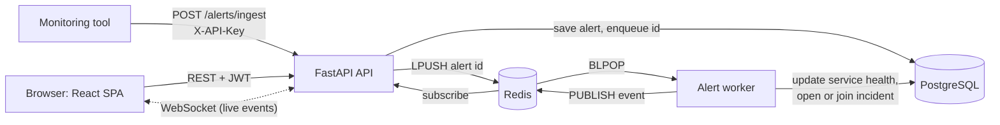
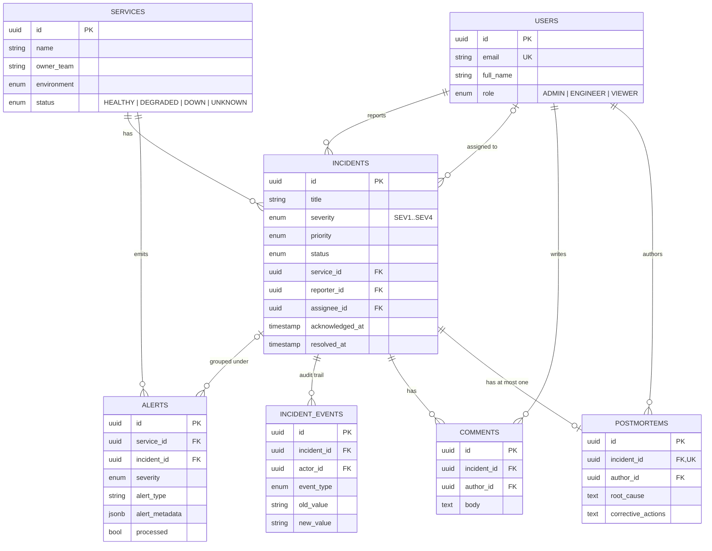

DevPulse
A mini PagerDuty / Opsgenie: an engineering incident and service management platform. Monitoring tools push alerts in, a background worker turns serious ones into incidents automatically, and engineers work each incident through a tracked lifecycle, all updating live in the browser.
Stack: FastAPI · PostgreSQL · Redis · async SQLAlchemy · Alembic · React · TypeScript · Tailwind · Docker · GitHub Actions
<!--
  Add three screenshots, then uncomment these lines:
  
  
  
What it does
Alert ingestion: `POST /alerts/ingest` (API-key protected) returns `202` immediately and hands the alert to a Redis queue.
Automatic triage: a worker process marks the affected service `DOWN` (SEV1) or `DEGRADED` (SEV2) and opens an incident. Further alerts for a service that already has an open incident group onto it instead of creating duplicates.
Incident lifecycle: `OPEN → INVESTIGATING → IDENTIFIED → MITIGATING → RESOLVED → CLOSED`, enforced on the server. Illegal jumps return `400`. A resolved incident can be reopened.
Audit trail: every status, severity, priority and assignee change is recorded as an immutable event with its actor.
Collaboration: comments, assignment ("Take this incident"), and postmortems (only for resolved or closed incidents).
Dashboard: active incidents, breakdowns by status and severity, mean time to acknowledge and to resolve.
Real time: one WebSocket pushes alert, incident and service-health events to every open browser.
Roles: `ADMIN`, `ENGINEER`, `VIEWER`, enforced by the API. The UI only mirrors those rules.
Architecture

The API and the worker are separate processes that share no memory. Redis is the bridge in both directions: a list carries work to the worker, and pub/sub carries results back to the API, which fans them out to WebSocket clients.
Data model

Deleting a service that still has incidents is refused (`409`, `ON DELETE RESTRICT`). Incident history is never silently destroyed.
Run it locally
Prerequisites: Docker, Python 3.12 + uv, Node 22.
```bash
# 1. Postgres and Redis
docker compose up -d postgres redis

# 2. Backend
cd backend
cp .env.example .env              # then set SECRET_KEY and ALERT_INGEST_API_KEY
uv sync
uv run alembic upgrade head
uv run fastapi dev app/main.py    # API on :8000, docs at /docs

# 3. Worker (second terminal, also in backend/)
uv run python -m app.workers.alert_worker

# 4. Frontend (third terminal)
cd frontend && npm install && npm run dev      # http://localhost:5173

# 5. Optional: demo data through the public API (needs the worker running)
cd backend && uv run python scripts/seed.py
```
Seeded logins: `admin@example.com`, `engineer@example.com`, `oncall@example.com`, `viewer@example.com`, all with password `demo-password-123`. Never run the seed against a real deployment.
Send an alert by hand:
```bash
curl -X POST http://localhost:8000/api/v1/alerts/ingest \
  -H "X-API-Key: $ALERT_INGEST_API_KEY" -H "Content-Type: application/json" \
  -d '{"service_id":"<uuid>","severity":"SEV1","alert_type":"high_cpu","message":"CPU at 98%","source":"curl"}'
```
Tests and CI
```bash
cd backend  && uv run pytest --cov=app        # 80 tests, ~96% coverage
cd frontend && npm test                        # 40 tests
```
The backend tests are integration tests against real PostgreSQL and Redis, not mocks, because the app depends on native enums, JSONB and Postgres-only SQL that a fake database would never exercise. They cover authentication and role rules, the full incident workflow, the alert → worker → incident pipeline (including alert-storm grouping), postmortem rules, the dashboard maths, WebSocket authentication and the 500-error handler.
GitHub Actions (`.github/workflows/ci.yml`) runs on every push and pull request:
Job	Checks
Backend	`ruff` lint · `alembic upgrade head` on an empty database · `alembic check` (fails if a model changed without a migration) · pytest with a 90% coverage gate
Frontend	unit and component tests · TypeScript type-check · production build
Docker	both production images build
Deploy
One command brings up the whole stack behind automatic HTTPS (Caddy → nginx → API, Postgres and Redis not exposed to the internet). See docs/DEPLOYMENT.md.
```bash
cp .env.prod.example .env.prod      # fill in every CHANGE_ME
docker compose --env-file .env.prod -f docker-compose.prod.yml up -d --build
```
API at a glance
Interactive docs are served at `/docs`.
Area	Routes
Auth	`POST /auth/register` · `POST /auth/login` (returns a JWT)
Users	`GET /users/me` · `GET /users/` (admin) · `GET /users/directory` (id to name, any user)
Services	`GET/POST /services/` · `GET/PATCH/DELETE /services/{id}` (writes are admin-only)
Incidents	`GET/POST /incidents/` (filter, search, paginate) · `GET/PATCH /incidents/{id}` · `PATCH .../assign` · `PATCH .../status` · `GET .../timeline`
Collaboration	`GET/POST .../comments` · `DELETE .../comments/{id}` · `GET/POST/PATCH .../postmortem`
Alerts	`POST /alerts/ingest` (API key) · `GET /alerts/` · `GET /alerts/{id}`
Dashboard	`GET /dashboard/summary`
Realtime	`WS /ws/updates?token=<jwt>`
Known limitations
Stated plainly, because they are the honest answer to "what would you do next?":
Live updates cover worker events only (alert ingested and processed, incident auto-created, service health changed). Status changes, assignments and comments made through the REST API do not broadcast, so a second tab sees them on refetch.
The JWT lives in `localStorage`, readable by any XSS. An httpOnly cookie is safer but needs CSRF protection and backend changes.
The WebSocket authenticates with `?token=` in the URL, because browsers cannot set headers on WebSockets. The app redacts it from its own logs and the nginx config logs paths only. The proper fix is a short-lived, single-use WebSocket ticket.
A failed alert is not retried. The worker takes an alert ID off the Redis list with `BLPOP` before processing it, and an exception is only logged, so that alert stays `processed=false` forever. A periodic sweep of unprocessed alerts (or Redis Streams with acknowledgements) is the fix.
Incident grouping is safe with one worker, not several. Two workers handling alerts for the same service at the same instant could both see "no open incident" and create two. A partial unique index (one open incident per service) or a row lock would close it.
No rate limiting on login or alert ingestion.
No password reset or email verification. New accounts are `ENGINEER`; admins are promoted in the database.
Data fetching is a small hand-written hook rather than TanStack Query. Proportionate here, and the thing to swap first as server state grows.
Project layout
```
backend/   FastAPI app (api → services → models), alert worker, Alembic migrations, tests, seed script
frontend/  React + TypeScript SPA (pages, contexts, typed API client) and its tests
docs/      Deployment guide and interview notes
docker-compose.yml        local Postgres and Redis
docker-compose.prod.yml   full production stack with HTTPS
```